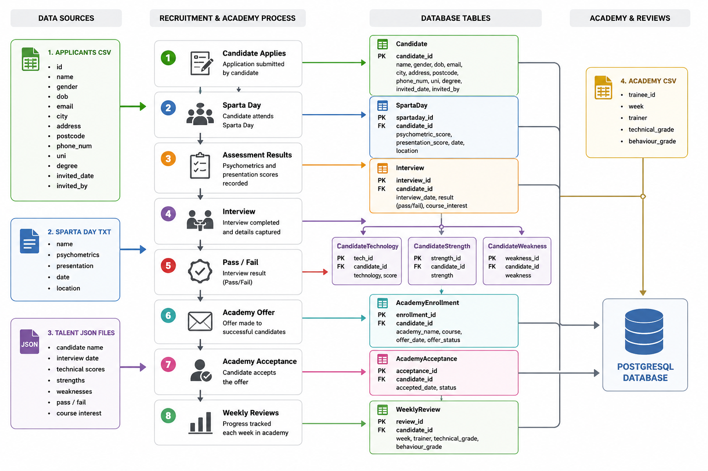
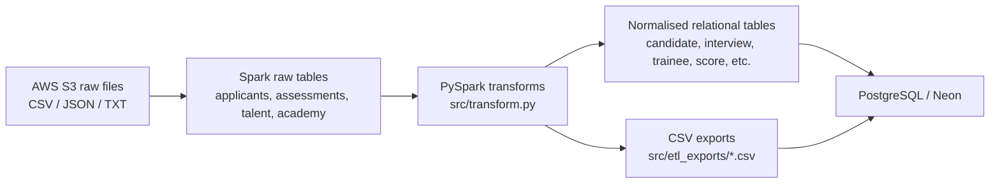

# Sparta Global Recruitment and Academy ETL Pipeline

End-to-end data engineering project built with PySpark, PostgreSQL, AWS S3 and Databricks to consolidate recruitment and academy data into a normalised analytical model.

## Architecture Diagram



The diagram illustrates how recruitment and academy data is extracted from multiple source systems, transformed using PySpark, and loaded into a normalised PostgreSQL database for reporting and analysis.

## Project Overview
This repository contains a data engineering project that consolidates fragmented recruitment and academy data into a normalised PostgreSQL model. The implementation combines PySpark transformations, S3 extraction scripts, SQL schema design, Databricks-oriented notebook workflows, and CSV export/load utilities.

The solution models the end-to-end lifecycle from candidate application through assessment, interview, academy enrolment, weekly review, and competency scoring.

## Business Objective
Sparta Global's operational data arrives in multiple formats and structures (CSV, JSON, and text) across different domains. The core business objective is to:
- unify these sources into a single relational model;
- improve data quality and consistency for downstream reporting;
- make candidate and trainee progression analysable across the full funnel;
- create a foundation for future analytics and visualisation work.

## Architecture Overview
At a high level, the project implements a classic ETL pipeline:
- **Extract**: pull raw files from AWS S3 (`Applicants.csv`, `Talent/*.json`, `Talent/*.txt`, `Academy/*.csv`);
- **Transform**: standardise, validate, parse, and normalise records with PySpark;
- **Load**: write curated tables to PostgreSQL/Neon (directly or via CSV exports).



## Technology Stack
- **Languages**: Python, SQL
- **Data processing**: PySpark, Pandas
- **Cloud/data sources**: AWS S3 (via `boto3`)
- **Databases**: PostgreSQL / Neon
- **Data access/load tooling**: SQLAlchemy, JDBC (design intent), `psycopg2`
- **Platform/tooling**: Databricks notebooks, Databricks bundle config (`databricks.yml`)
- **Collaboration/project management**: Git, GitHub, Trello, Agile/Scrum

## Installation Instructions
### Prerequisites
- Python 3.10+ (recommended)
- Java runtime compatible with your Spark version
- Access credentials for:
  - AWS S3 bucket used by the extraction scripts
  - PostgreSQL/Neon target database

### Environment setup
```bash
git clone <your-fork-or-repo-url>
cd Data602ProjectRoom2
python -m venv .venv
source .venv/bin/activate  # On Windows PowerShell: .venv\Scripts\Activate.ps1
pip install pyspark pandas boto3 sqlalchemy psycopg2-binary
```

### Configuration
The runtime expects database configuration values in `src/config.py` (this file is ignored by Git). Define:
- `JDBC_URL`
- `DB_USER`
- `DB_PASSWORD`

For production-grade usage, prefer environment variables or a secret manager rather than hard-coded credentials.

## Usage Instructions
Because this repository includes both notebook-driven and script-based workflows, usage depends on your execution context.

### 1) Prepare raw tables in Spark
Use the extraction scripts under `src/extract/` (or Databricks notebooks) to ingest S3 source files into Spark tables. The transform layer currently expects `all_applicants`, `all_assessments`, `all_talent`, and `all_academy`, so ensure your table names are aligned before running `src/main.py`.

### 2) Run transformations and pipeline orchestration
Use `src/main.py` to build transformed DataFrames and load destination tables (requires Spark and database config).

### 3) Optional CSV export workflow
Use `src/export_tables.py` to materialise transformed outputs into `src/etl_exports/`.

### 4) Optional CSV-to-Neon load workflow
Use `src/load_to_neon.py` to append exported CSV tables to Neon in FK-safe load order.

## Project Structure
```text
Data602ProjectRoom2/
├── README.md
├── databricks.yml
├── databricks/
│   ├── extract_applicants.py
│   ├── ingest.py
│   ├── transform.py
│   └── load.py
├── docs/
│   ├── erd.png
│   ├── project-plan.md
│   └── user-stories.md
├── notebook/
│   ├── Group Project.ipynb
│   ├── silver_applicants.ipynb
│   ├── silver_assessments.ipynb
│   ├── silver_talent.ipynb
│   └── silver_academy.ipynb
├── sql/
│   ├── schema.sql
│   └── queries.sql
├── src/
│   ├── main.py
│   ├── transform.py
│   ├── load.py
│   ├── export_tables.py
│   ├── load_to_neon.py
│   ├── test_connection.py
│   ├── extract/
│   │   ├── extract_applicants.py
│   │   ├── extract_assessments.py
│   │   ├── extract_talent.py
│   │   └── extract_academy.py
│   └── etl_exports/
│       ├── candidate.csv
│       ├── assessment.csv
│       ├── interview.csv
│       ├── ...
├── tests/
│   └── test_etl.py
└── typings/
    └── __builtins__.pyi
```

## Data Flow
1. **Extract**
   - `src/extract/extract_applicants.py`: loads applicant CSV files from S3.
   - `src/extract/extract_assessments.py`: flattens assessment text files into line-level records.
   - `src/extract/extract_talent.py`: normalises talent JSON files.
   - `src/extract/extract_academy.py`: ingests academy CSV files and tags source metadata.
2. **Transform**
   - `src/transform.py` builds normalised dimensions/facts and bridge tables:
     - `candidate`, `assessment`, `interview`
     - `technology`, `strength`, `weakness`, `trainer`, `competency`
     - `candidate_technology`, `candidate_strength`, `candidate_weakness`
     - `trainee`, `weekly_review`, `score`
3. **Load**
   - `src/load.py`: loader interface per destination table.
   - `src/load_to_neon.py`: CSV-based append load into Neon.
4. **Schema governance**
   - `sql/schema.sql`: table definitions, keys, and referential constraints.

### Current exported output snapshot (`src/etl_exports`)
- `candidate.csv`: 4,691 rows
- `assessment.csv`: 4,130 rows
- `interview.csv`: 3,103 rows
- `trainee.csv`: 397 rows
- `weekly_review.csv`: 3,970 rows
- `score.csv`: 19,542 rows

## Major Modules and How They Work Together
- **`src/main.py`**: pipeline orchestrator; creates Spark session, runs transforms, validates row counts, and triggers loads.
- **`src/transform.py`**: core business logic for cleaning, parsing, matching, normalising, and key generation.
- **`src/load.py`**: table-specific load wrappers around a generic loader function.
- **`src/extract/*.py`**: source ingestion from S3 into Spark-readable tables.
- **`src/export_tables.py` + `src/load_to_neon.py`**: alternative two-step pathway (export then load).
- **`sql/schema.sql`**: canonical relational contract that the ETL targets.
- **`notebook/*.ipynb`**: exploratory and silver-layer transformation work used to validate approach.

## Key Features
- Multi-source ingestion across heterogeneous formats (CSV, JSON, TXT).
- Standardised text cleaning and null handling with reusable helper functions.
- Flexible date parsing for inconsistent source date formats.
- Candidate matching across datasets using normalised name keys.
- Unpivoting of wide technology and competency-week structures into relational form.
- Fully normalised schema design with fact/dimension and bridge-table patterns.
- Ordered loading strategy for foreign-key-safe inserts.

## ETL, Analytics, ML, API, and Visualisation Components
- **ETL/Data Engineering**: implemented.
- **ELT-style notebook silver layers**: partially implemented in notebooks.
- **Analytics SQL layer**: schema present; `sql/queries.sql` currently empty.
- **Machine learning**: not implemented in this repository.
- **API services**: not implemented in this repository.
- **Visualisation/dashboarding**: no dashboard code in repo; ERD design resources provided.

## Technical Challenges
- Reconciling inconsistent source schemas and naming conventions.
- Handling mixed date formats and split date fields (`invited_date` + `month`).
- Mapping candidate identities between sources where stable IDs are not consistently shared.
- Transforming wide weekly competency columns into normalised score records.
- Balancing notebook experimentation and production-ready script structure.
- Managing runtime dependencies between Databricks globals and local script execution.

## Lessons Learned
- Early schema-first thinking (`sql/schema.sql`) improves transformation clarity.
- Name standardisation and data quality checks are critical before cross-source joins.
- Building reusable Spark helper functions reduces duplicated cleaning logic.
- Incremental notebook exploration is useful, but production pipelines need stricter packaging, tests, and configuration management.

## Future Improvements
- Add a proper dependency manifest (`requirements.txt` or `pyproject.toml`).
- Implement complete automated testing in `tests/test_etl.py`.
- Replace hard-coded credentials with environment-variable/secret-manager patterns.
- Resolve table naming consistency across extract and transform layers.
- Finalise Databricks script modules (`databricks/ingest.py`, `transform.py`, `load.py`).
- Populate `sql/queries.sql` with reusable analytics queries.
- Expand operational documentation in `docs/project-plan.md` and `docs/user-stories.md`.

## Screenshots/Diagrams
- **Database ERD (external)**: [Lucidchart ERD](https://lucid.app/lucidchart/1b20898e-7bbb-4a2b-a74b-ddf758de2c46/edit?invitationId=inv_dccf5f6c-687c-4862-9100-6ad4f48f462c&page=0_0#)
- **Repository diagram asset**: `docs/erd.png` (present in repository as a placeholder file)

## Project Management and Supporting Documentation
- Trello board: [Trello Scrum Board](https://trello.com/b/O4sMbjqY)
- Documentation reference: [Documentation Guide]((https://docs.google.com/document/d/1Gt9wlIZn-vQ3SaXFqwD9N4hcl6RuJ-4aRfMSQg9CbVA/edit?tab=t.0))
